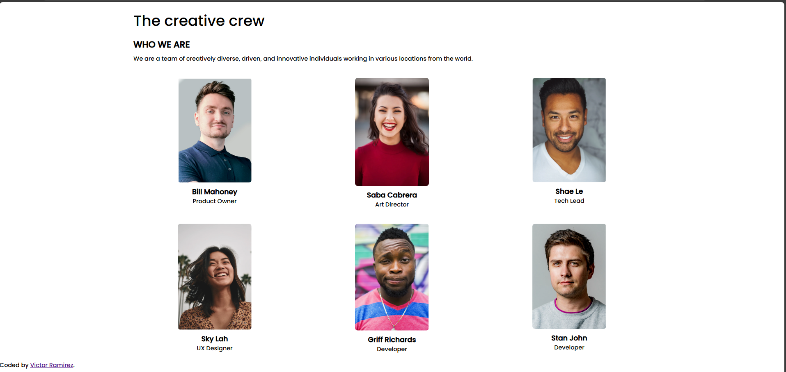

# Make It Real - NAME OF THE PROJECT

This is a solution to the **My-Team-Page** project of the Make It Real course.

## Table of contents

- [Overview](#overview)
  - [The challenge](#the-challenge)
  - [Screenshot](#screenshot)
- [My process](#my-process)
  - [Built with](#built-with)
  - [What I learned](#what-i-learned)
  - [Continued development](#continued-development)
  - [Useful resources](#useful-resources)
- [Author](#author)
- [Acknowledgments](#acknowledgments)

## Overview

### The challenge

Users should be able to:

- View each team member’s name, role, and profile picture in a structured layout
- See the role of each team member displayed vertically to the side of their profile picture

### Screenshot

<div align="center">
  
</div>

## My process

During this project, I focused on creating a clean and responsive layout that meets the challenge requirements. I utilized CSS Grid to arrange the team members' information effectively.

### Built with

- Semantic HTML5 markup
- CSS custom properties
- Flexbox
- CSS Grid
- Mobile-first workflow

### What I learned

Through this project, I learned how to use CSS Grid effectively to organize content in a responsive layout. I also practiced using the `writing-mode` and `text-orientation` CSS properties to display the role of each team member vertically.

Here's a sample of the code that handles the vertical orientation of the role text:

```css
.role {
  writing-mode: vertical-rl;
  text-orientation: upright;
  font-size: 0.9rem;
  color: #555;
  position: absolute;
  left: -30px;
  top: 50%;
  transform: translateY(-50%);
```

### Continued development

In future projects, I want to continue focusing on responsive design and accessibility. This project highlighted the importance of ensuring that content is visually appealing and accessible across different screen sizes.

### Useful resources

- **CSS Tricks - A Complete Guide to Flexbox**
  This guide helped me better understand Flexbox and its various properties.

- **MDN Web Docs - Writing Modes**
  This was crucial for understanding how to display text vertically and make it fit well within the design.

## Author

- Victor Ramirez - [@Victormrl17](https://github.com/Victormrl17)

## Acknowledgments

A special thanks to Make it Real, especially [@khriztianmoreno](https://github.com/khriztianmoreno) for the valuable feedback during daily meetings and demos, and to [@nayruthCalla](https://github.com/nayruthCalla) for the support and review.
